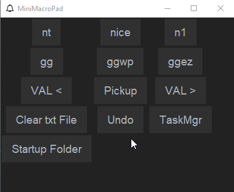
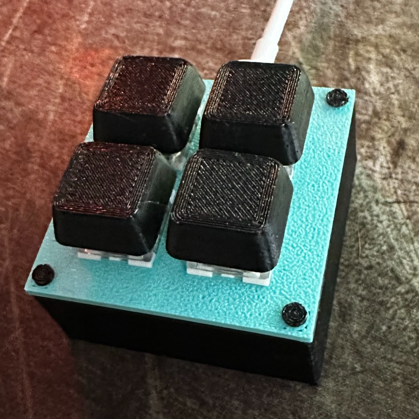
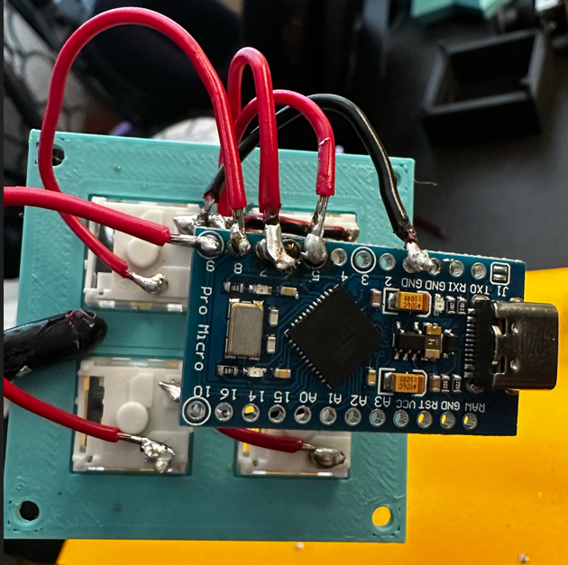

# MiniMacroPad

Keyboard firmware and driver for my 3D printed macropad. You can use a Arduino Pro Micro (or teensy lc in my case).

The goal of this project is to have a physical macro pad that you can customize. You can set keyboard/mouse macros with it for general use, and it supports not having the physical buttons too if you don't have the hardware.

See [my thangs.com model](https://thangs.com/designer/sebsafari/3d-model/Mini%20Macro%20Pad-710028?manualModelView=true) for the related STL files that you can print.

## Firmware / arduino stuff
See `MiniMacroPad.ino` for more details, but basically you click a button and it sends a serial number of what button you pressed. For this example the macropad is a 2x2 layout.

## Driver (GUI)
A python TK GUI provides functionality to the mini macro pad. All driver related code is under the `driver/` folder.

> This screenshot may be out of date.

## Setup environment
> This is for windows

- Install [Python3](https://www.python.org/downloads/windows/)
- Clone this repo / download & extract zip
  - https://github.com/ssebs/MiniMacroPad (https)
  - git@github.com:ssebs/MiniMacroPad.git (ssh)
- `PS> cd mmp/`
- `PS driver> python3 -m venv venv`
- `PS driver> .\venv\Scripts\Activate.ps1`
  - `(venv) PS driver> pip install -r requirements.txt`

### Running in dev
- Once in a virtual environment (venv)
  - `(venv) PS driver> python minimacropad.py`

### Building the .exe
- Update the mmp.spec file to match your folder!
- `(venv) PS driver> pyinstaller mmp.spec`
    - Built file is under `./dist/`
    - Run this .exe

#### Running at startup
- Hit `WIN + R`
  - Enter `shell:startup` in the dialog, hit enter to open the folder
  - Copy the .exe file to this folder

## Usage - using the MiniMacroPad
Once the arduino has been all setup & is connected OK, you'll need to run the driver exe once before continuing.

After running once, take a look at the generated config file. Please see the below section.

TBD: User guide

## Config file
There is a `C:\Users\<username>\minimacropad-config.json` file that controls the configuration of the macro pad. See [CONFIG.md](./CONFIG.md) for more details.

## To-do's
Check out the [TODO.md](./TODO.md) file for what's next on the agenda. I prefer using this MD file rather than github issues - at least for now.

## Hardware
You'll need an arduino with some buttons. 
Screenshot of mine below:

TBD: wiring diagram

TBD: better instructions

## LICENSE
[GPL v3](./LICENSE)
